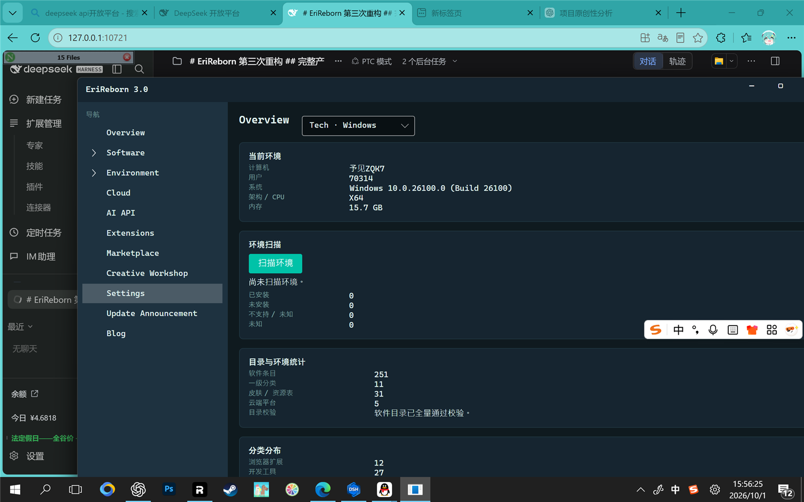

# EriReborn

> .NET 8 + Avalonia 的环境重建与管理平台，支持 Windows 与 Android 双平台。

EriReborn 用来在新机器或重装系统后，一站式完成软件检索、下载、安装与环境配置：
内置多网盘资源定位与下载通道、本机软件检测、皮肤与人格系统、AI 助手，以及扩展/插件市场。

## 功能特性

- **软件管理**：软件目录浏览、本机已装软件检测、下载与安装状态跟踪。
- **多网盘下载**：123 云盘、百度网盘、夸克网盘、蓝奏云、迅雷五家 Provider 平级实现，
  下载经 Aria2 扩展执行。
- **皮肤 / 人格 / 素材**：可切换皮肤、角色人格与启动器外观，支持皮肤独立编辑窗口。
- **AI 助手**：多服务商配置（OpenAI 兼容与 Anthropic 协议），Key 仅保存在本机。
- **扩展与插件系统**：独立加载上下文的扩展宿主，随包提供五个云盘扩展、Aria2 下载扩展、
  Reader 扩展；另含 [示例扩展](samples/EriReborn.SampleExtension)。
- **可信目录**：随包软件目录带签名校验（`assets/trust/keys.json` 为信任公钥），
  被篡改的条目会自动从 Official 降级为 Untrusted。
- **新手教程**：首次启动自动进入引导；完成状态记录在本机用户数据中。
- **Windows / Android**：共享 UI 与领域层，两个可执行入口分别构建。

## 仓库结构

    src/
      EriReborn.Core                  领域模型、目录、任务、状态存储（零项目引用）
      EriReborn.Platform.Abstractions 平台契约（只引用 Core）
      EriReborn.Cloud                 五家网盘 Provider，完全平级
      EriReborn.Engine                软件引擎、下载、插件、AI
      EriReborn.Skin / Asset / Layout / Persona   表现层数据
      EriReborn.Extension             扩展与市场（含隔离加载上下文）
      EriReborn.Platform.Windows      Windows 真实实现（注册表、MSI、Authenticode）
      EriReborn.Platform.Android      Android 真实实现
      EriReborn.App.Shared            共享服务装配
      EriReborn.UI.Avalonia           界面
      EriReborn.Desktop / Mobile      两个可执行入口
      Extensions/                     随包扩展（五网盘 / Aria2 / Reader）
    tests/         单元测试（Core 与 Windows 两个套件）
    samples/       扩展示例
    tools/         测试运行器、回归 / 变异脚本、烟雾工具、扩展宿主
    assets/        皮肤、人格、图标、音效、教程与信任公钥等素材
    docs/shots/    界面截图

**分层由测试守住**：架构不变量测试会读取 csproj 与源码，
任何越界的项目引用都会导致测试失败。

## 环境要求

- .NET SDK 8.0（版本见 [global.json](global.json)）
- Android 构建需要 `ANDROID_HOME`（默认 `%LOCALAPPDATA%\Android\Sdk`）

## 构建与测试

桌面端 Release 构建：

    dotnet build src\EriReborn.Desktop\EriReborn.Desktop.csproj -c Release

全量测试（Core + Windows，进程内运行器，PowerShell）：

    powershell -NoProfile -ExecutionPolicy Bypass -File tools\run-tests.ps1

也可使用回归脚本（Release 0 警告构建 + 计数交叉校验 + 测试套件）：

    tools\regression.cmd

发布 Windows x64 自包含单目录：

    dotnet publish src\EriReborn.Desktop\EriReborn.Desktop.csproj -c Release -r win-x64 --self-contained true -o publish\win-x64

> 程序首次启动会在 exe 旁创建便携数据目录 `EriReborn-data/`，
> 登录态与凭据存放在 `EriReborn-credentials/`（加密），二者均不进入源码与发布基线。

## 关于私有数据

仓库中的软件目录数据、网盘分享定位数据以及官方插件的生成脚本属于作者私人数据资产，
**不随公开仓库发布**（见 [.gitignore](.gitignore)）：

- `assets/catalog/`、`assets/shares/`（带签名的随包软件目录与网盘定位数据）
- `tools/generate-official-plugin.mjs`、`tools/locate-official-shares.mjs`、
  `tools/import-asset-library.mjs`

缺失这些数据时程序可正常编译运行，仅随包官方软件列表为空；
依赖该目录签名链的少量测试用例在克隆环境下会因找不到数据目录而失败，属预期现象。

## 开发约定

- 不允许用 TODO / NotImplementedException / 空实现假装完成（有测试检查）。
- 做不到的能力如实报告 Unsupported / Unknown，不用 Noop 假装成功。
- 五家网盘完全平级，契约中不得出现 Priority / Rank / Order 字段（有测试检查）。
